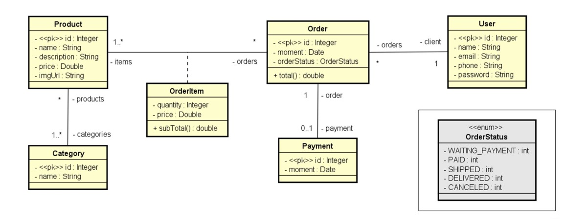

# Pedidos 
[](https://github.com/Lucas-iferreira/workshop-springboot3-jpa/blob/main/LICENSE) 

# Sobre o projeto

Este projeto é uma aplicação backend construída com Java 17, Spring Boot 3 e JPA/Hibernate, que simula um sistema de gerenciamento de pedidos. Ele foi desenvolvido com fins educacionais, abordando os principais conceitos de desenvolvimento web com Spring.

# Objetivo
- Criar projeto Spring Boot Java
- Implementar modelo de domínio com entidades relacionadas
- Estruturar camadas lógicas: Controller (Resource), Service e Repository
- Configurar banco de dados de teste (H2)
- Povoar o banco de dados com dados de teste
- Implementar operações CRUD (Create, Read, Update, Delete)
- Tratar exceções de forma adequada

## Modelo conceitual


# Tecnologias utilizadas
- Java
- Spring Boot
- JPA / Hibernate
- Maven
- Postman
- H2 Database


# Como executar o projeto

Pré-requisitos: Java 17

```bash
# clonar repositório
git clone https://github.com/Lucas-iferreira/workshop-springboot3-jpa.git

# entrar na pasta do projeto back end
cd backend

# executar o projeto
./mvnw spring-boot:run
```

# Agradecimentos
Agradeço ao professor [Nelio Alves](https://www.linkedin.com/in/nelio-alves/) pelo projeto realizado junto ao seu curso da Udemy, que me proporcionou ganhos de conhecimentos notáveis em JAVA.

# Autor

Lucas Ferreira

https://www.linkedin.com/in/lucas-iferreira/
